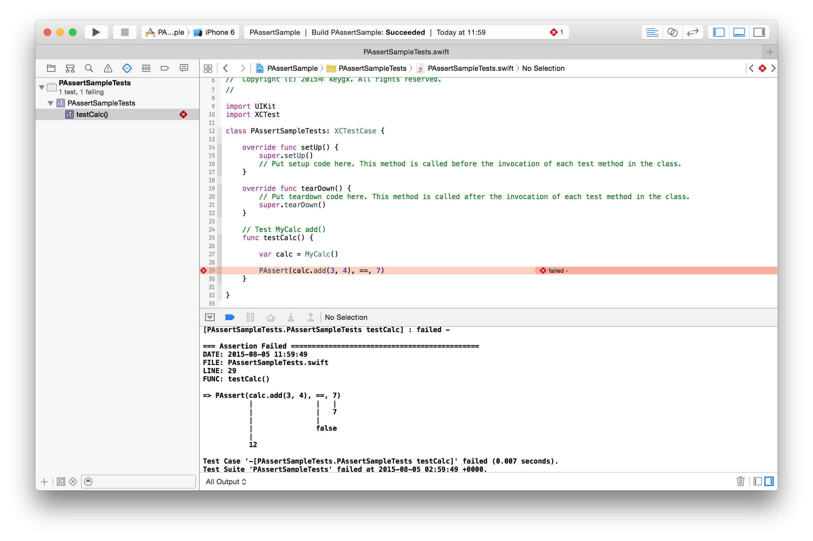

# PAssert

Power Assert inspired Test tool for XCTest by Swift




## Requirements
- Swift 1.2
- iOS 8.0 or later

## Installation

To integrate "XCTest+PAssert.swift" into your Xcode project Test Target

## Usage

Example Test Code

```
import UIKit
import XCTest

class PAssertSampleTests: XCTestCase {
    
    override func setUp() {
        super.setUp()
        // Put setup code here. This method is called before the invocation of each test method in the class.
    }
    
    override func tearDown() {
        // Put teardown code here. This method is called after the invocation of each test method in the class.
        super.tearDown()
    }
    
    // Test MyCalc add()
    func testCalc() {
        
        var calc = MyCalc()
        
        PAssert(calc.add(3, 4), ==, 7)
    }
    
}

```

Test failure

```

=== Assertion Failed =============================================
DATE: 2015-08-04 21:04:52
FILE: PAssertSampleTests.swift
LINE: 29
FUNC: testCalc()

=> PAssert(calc.add(3, 4), ==, 7)
           |               |   |
           |               |   7
           |               |
           |               false
           |
           12

```

## License

PAssert is released under the MIT license. See LICENSE for details.

## Author

Yukihiko Kagiyama (keygx) <https://twitter.com/keygx>

